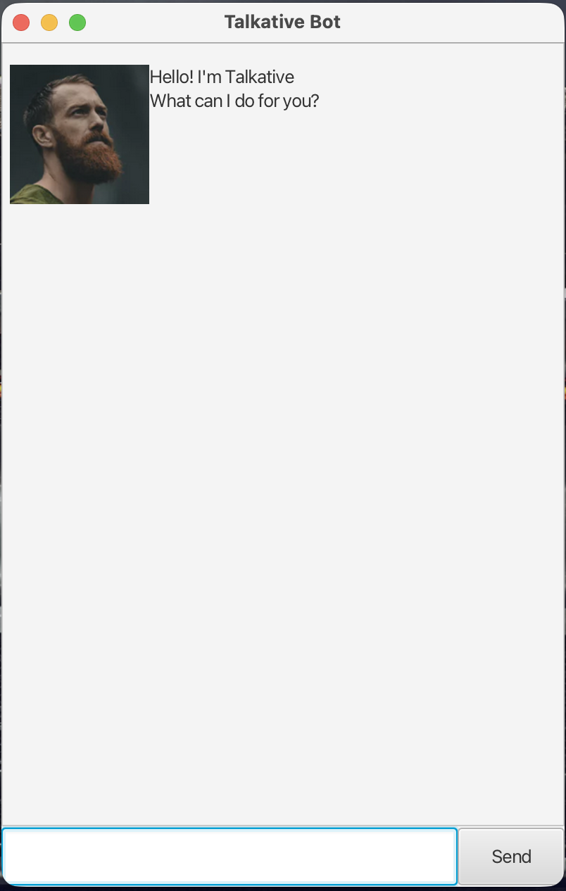

# Talkative User Guide



## Introduction
**Talkative** is a desktop task management chatbot with a graphical user interface (GUI).  
It allows users to manage tasks efficiently using simple text commands.

Talkative supports:
- Adding tasks (Todo, Deadline, Event, DoWithin)
- Marking tasks as done/undone
- Searching and deleting tasks

---
## Quick Start

1. Ensure you have **Java 17 or above** installed.
2. Download the `.jar` file.
3. Open a terminal and run:
```
java -jar Talkative.jar
``` 
4. Type commands into the input box and press **Enter**.

---

## Features

### Adding a todo task: `todo`

Adds a task without a date.

**Format:**
``` 
todo DESCRIPTION
```
**Example:**
```
todo read book
```
**Expected output:**
```
Got it. I've added this task:
[T][ ] read book
Now you have 1 tasks in the list.
```
---

### Adding a deadline: `deadline`

Adds a task with a due date.

**Format:**
```
deadline DESCRIPTION /by DATE
```
**Example:**
```
deadline submit assignment /by 2026-02-20
```
---

### Adding an event: `event`

Adds a task with a start and end date.

**Format:**
```
event DESCRIPTION /from START /to END
```
**Example:**
```
event project meeting /from 2026-02-20 /to 2026-02-21
```
---

### Adding a DoWithin task: `dowithin`

Adds a task that must be completed within a time period.

**Format:**
```
dowithin DESCRIPTION /from START /to END
```
**Example:**
```
dowithin collect certificate /from 2026-02-15 /to 2026-02-25
```
---

### Listing all tasks: `list`

Displays all tasks.

**Format:**
```
list
```
---

### Finding tasks: `find`

Searches for tasks containing a keyword.

**Format:**
```
find KEYWORD
```
**Example:**
```
find book
```
---

### Marking a task as done: `mark`

Marks a task as completed.

**Format:**
```
mark INDEX
```
---

### Unmarking a task: `unmark`

Marks a task as not done.

**Format:**
```
unmark INDEX
```
---

### Deleting a task: `delete`

Deletes a task from the list.

**Format:**
```
delete INDEX
```
---

### Exiting the application: `bye`

Closes the application.

**Format:**
```
bye
```

---

## Error Handling

If an invalid command is entered, Talkative will display an error message such as:
```
I'm sorry, I don't understand that command.
```
If required input is missing:
```
A todo cannot be empty.
```
---

## Command Summary

| Command   | Description |
|----------|------------|
| `todo` | Add a todo task |
| `deadline` | Add a deadline |
| `event` | Add an event |
| `dowithin` | Add a task within a period |
| `list` | Show all tasks |
| `find` | Search tasks |
| `mark` | Mark task as done |
| `unmark` | Unmark task |
| `delete` | Delete task |
| `bye` | Exit |

---

## Notes

- Dates should follow format: `yyyy-MM-dd`
- Index refers to the task number shown in the list